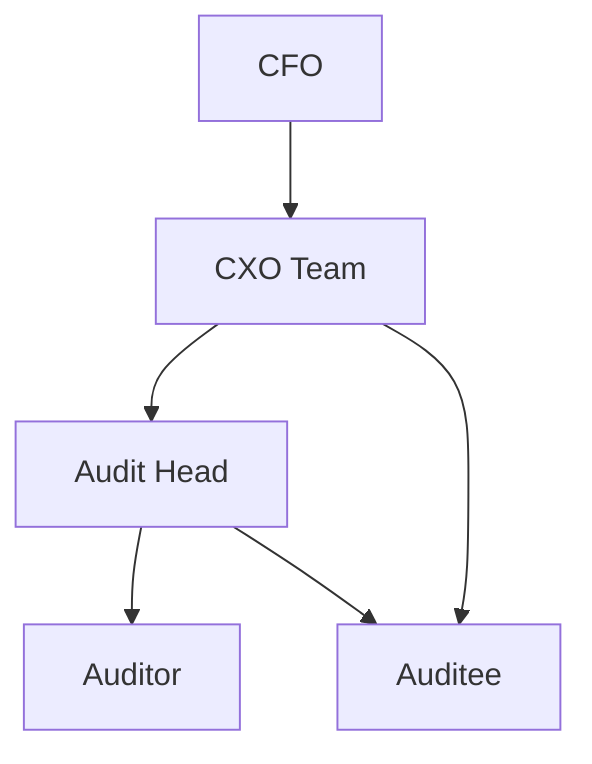
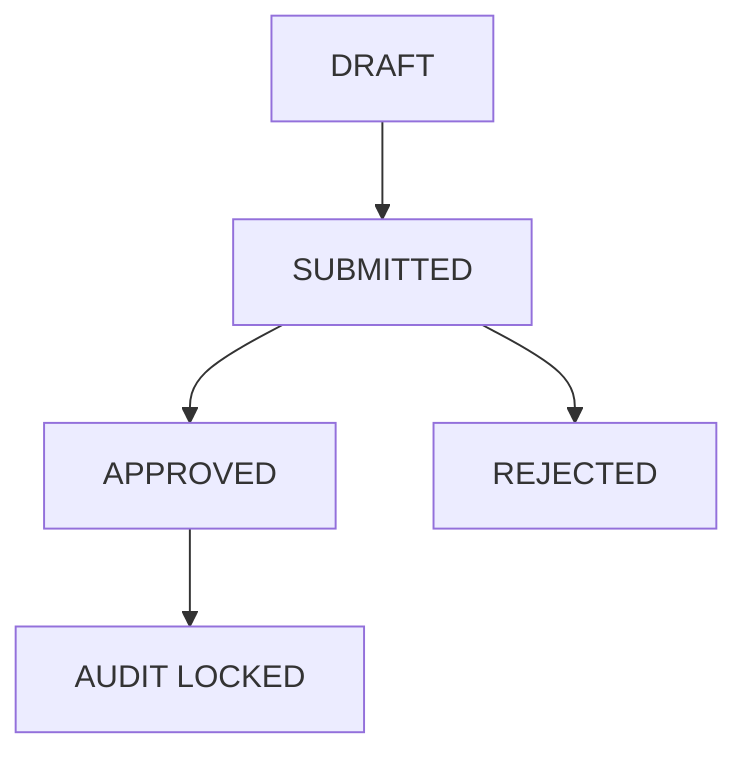

# RBAC v2 — Design for MVP

**Document Version**: 2.0
**Status**: Implementation Spec
**Date**: 2025-01-22

> **⚠️ FRESH IMPLEMENTATION APPROACH**
>
> This design assumes a **clean slate** - the existing database will be dropped and recreated with the new schema. No backward compatibility or data migration is required since we're in MVP testing phase with no production data to preserve.

---

## Goals and Constraints

- **Keep it simple**: 5 roles, minimal schema changes, centralize enforcement, few new endpoints
- **Fresh start**: Drop old database and implement clean schema with new RBAC from scratch
- **Consistency**: All checks go through `src/lib/rbac.ts` and are logged via `src/server/auditTrail.ts`
- **UI is never the security boundary**: API must enforce everything

---

## Roles and Responsibilities

### CFO
- **Organization-level superuser**
- Sees and does everything
- Can override locks and approvals

### CXO Team
- Manages plants and audits
- Assigns users, configures visibility, locks audits, marks completion
- **No observation authoring or approval authority**

### Audit Head
- Leads assigned audit(s)
- Approves or rejects observations
- Can delete observations while audit is open
- Can also create and edit draft observations

### Auditor
- Creates and edits draft observations
- Submits for approval to Audit Head
- **Cannot approve or delete**

### Auditee
- **Assignment-based access**
- Can view assigned observations
- Can edit only auditee fields
- Can edit auditee fields even after approval while audit is open

---

## Simple, Implementable Rules

1. **CFO always allowed**
2. **CXO Team** can fully manage audits and plants; cannot author/approve observations
3. **Audit Head** can approve and delete observations for their assigned audit(s) while open; cannot when locked
4. **Auditor** can create/edit draft and submit; cannot change after submission unless rejected
5. **Auditee** can edit only auditee fields, only on observations they are assigned to, and only when the parent audit is not locked
6. **Audit lock** freezes everything except CFO override
7. **Visibility** is configured at audit level by CXO Team; auditors see their assigned current audits plus historical audits allowed by visibility rules
8. **Auditees** only see assigned observations; guests are out of scope by default (optional read-only retention)

---

## Data Model (Fresh Implementation)

### Role enum in `prisma/schema.prisma`

```prisma
enum Role {
  CFO           // Organization superuser with full access
  CXO_TEAM      // Staff and analysts who manage audits and plants
  AUDIT_HEAD    // Approves observations and can delete while audit open
  AUDITOR       // Creates observations and submits for approval
  AUDITEE       // Assigned to observations, edits designated fields only
  GUEST         // Optional: Read-only access with scope restrictions
}
```

### Audit model extensions in `prisma/schema.prisma`

```prisma
model Audit {
  // ... existing fields
  isLocked           Boolean   @default(false)
  lockedAt           DateTime?
  lockedById         String?
  completedAt        DateTime?
  completedById      String?
  visibilityRules    Json?     // Stores visibility configuration
  auditHeadId        String?   // References User; singles out the audit's audit head
  auditHead          User?     @relation("AuditHead", fields: [auditHeadId], references: [id])
}
```

### Observation model extensions in `prisma/schema.prisma`

```prisma
enum ApprovalStatus {
  DRAFT           // Created by Auditor, editable
  SUBMITTED       // Submitted for Audit Head review
  APPROVED        // Approved by Audit Head
  REJECTED        // Rejected by Audit Head, returns to DRAFT
}

model Observation {
  // ... existing fields
  approvalStatus    ApprovalStatus  @default(DRAFT)
  assignments       ObservationAssignment[]  // Track auditee assignments
}
```

### ObservationAssignment model in `prisma/schema.prisma`

```prisma
model ObservationAssignment {
  id            String      @id @default(cuid())
  observationId String
  auditeeId     String
  assignedAt    DateTime    @default(now())
  assignedById  String?     // Who assigned this auditee
  observation   Observation @relation(fields: [observationId], references: [id], onDelete: Cascade)
  auditee       User        @relation("AuditeeAssignments", fields: [auditeeId], references: [id], onDelete: Cascade)
  assignedBy    User?       @relation("AssignedBy", fields: [assignedById], references: [id])

  @@unique([observationId, auditeeId])
  @@index([auditeeId])
}
```

### Indices

- Ensure index on `Audit.auditHeadId` and `ObservationAssignment.auditeeId`
- Unique constraint on `ObservationAssignment` composite key `[observationId, auditeeId]`
- Keep existing `AuditAssignment` as-is for auditors

---

## Enforcement Strategy

### Central RBAC helpers in `src/lib/rbac.ts`

**New helpers**:
```typescript
isCFO(role)
isCXOTeam(role)
isAuditHead(role)
isAuditor(role)
isAuditee(role)
assertCFOOrCXOTeam(role)
assertAuditHead(role)
assertAuditorOrAuditHead(role)
```

**CFO short-circuit**: CFO passes all asserts.

### Audit lock checks everywhere

Before any mutation to audit or observations, check `audit.isLocked`. Deny unless CFO.

### Observation approval authority

Approve/Reject routes allow only Audit Head of the observation's audit (plus CFO override).

### Observation delete authority

Allowed to CFO always; Audit Head only when audit open.

### Visibility control

- For audit lists and related observation lists, apply `visibilityRules` if the requesting role is Auditor or Audit Head
- CXO and CFO see all
- Auditees see only observations where they have an `ObservationAssignment` record

### Field-level permissions for observation update

**Auditor set**: Observation authoring fields
- `observationText`
- `risksInvolved`
- `riskCategory`
- `likelyImpact`
- `concernedProcess`
- `auditorPerson`

**Auditee set**: Auditee response fields
- `auditeePersonTier1`
- `auditeePersonTier2`
- `auditeeFeedback`
- `personResponsibleToImplement`
- `targetDate`
- Action plan fields (where specifically allowed)

**Audit Head** inherits Auditor capabilities.

**After approval**: Only auditee fields can be edited by auditees while audit is open; others need change request (if retained).

### Scope system

Keep existing scope utilities in `src/lib/scope.ts` for GUEST if retained; not required for Auditee in v2.

---

## API Implementation

### 1. RBAC helpers

Implement helpers in `src/lib/rbac.ts`. Keep predicates and assertion throwers simple and clear.

### 2. Observations collection GET in `src/app/api/v1/observations/route.ts`

- **CFO, CXO Team**: See all
- **Audit Head, Auditor**: See observations for audits they are assigned to
  - Audit Head is determined by `Audit.auditHeadId`
  - Auditor by existing `AuditAssignment`
- **Auditee**: See only assigned observations via `ObservationAssignment`
- Respect `visibilityRules` for Auditor and Audit Head on historical audits

### 3. Observation PATCH in `src/app/api/v1/observations/[id]/route.ts`

- Block if audit locked (unless CFO)
- Enforce field-level sets:
  - **CFO**: All fields
  - **Audit Head, Auditor**: Auditor fields on draft or rejected; block after submitted unless rejected or change request workflow applies
  - **Auditee**: Auditee fields only, must have `ObservationAssignment`, allowed even after approval if audit open

### 4. Observation submit route in `src/app/api/v1/observations/[id]/submit/route.ts`

- Allow Auditor and Audit Head
- Block if locked

### 5. Observation approve/reject routes (NEW)

**Add approve and reject routes**:
- `src/app/api/v1/observations/[id]/approve/route.ts`
- `src/app/api/v1/observations/[id]/reject/route.ts`

**Assertions**: Only Audit Head for the observation's audit (CFO override), block if locked

### 6. Observation delete

If a delete endpoint exists in `src/app/api/v1/observations/[id]/route.ts`, gate as:
- CFO always allowed
- Audit Head allowed only when audit not locked

If absent, add DELETE branch.

### 7. Observation assign auditee (NEW)

**Add**: `src/app/api/v1/observations/[id]/assign-auditee/route.ts`

- **Allowed roles**: CFO, CXO Team, Audit Head, Auditor
- Creates `ObservationAssignment` row with `assignedById`

### 8. Audits collection and detail

**Files**: `src/app/api/v1/audits/route.ts` and `src/app/api/v1/audits/[id]/route.ts`

- **Creation/editing**: CFO and CXO Team only
- **Listing**:
  - CFO and CXO Team see all
  - Audit Head and Auditor see assigned audits, filtered by visibility for historical lists

### 9. Audit lock, unlock, complete (NEW)

**Add POST routes**:
- `src/app/api/v1/audits/[id]/lock/route.ts`
- `src/app/api/v1/audits/[id]/unlock/route.ts`
- `src/app/api/v1/audits/[id]/complete/route.ts`

- **Allowed roles**: CFO and CXO Team
- Completion sets `completedAt` and `completedById` and auto-locks
- CFO can unlock locked audits; CXO Team should typically not unlock completed audits (enforce by policy)

### 10. Audit visibility (NEW)

**Add**: `src/app/api/v1/audits/[id]/visibility/route.ts`

- **Allowed roles**: CFO and CXO Team only
- Set `visibilityRules`
- Keep rules simple: `show_all`, `last_12m`, `explicit:{auditIds:[]}`, `hide_all` (stored as JSON)

---

## UI Implementation

### Navigation in `src/components/NavBar.tsx`

- **CFO**: Plants, Audits, Observations, Reports, Users
- **CXO Team**: Plants, Audits, Reports, Users
- **Audit Head**: Audits, Observations, Reports
- **Auditor**: Audits, Observations
- **Auditee**: Observations

### Audits detail page in `src/app/(dashboard)/audits/[auditId]/page.tsx`

- Add Lock, Unlock, Complete buttons for CFO/CXO only
- Reflect current locked/completed status
- Visibility config panel for CFO/CXO

### Audits list page in `src/app/(dashboard)/audits/page.tsx`

- Creation form visible to CFO/CXO only
- Listing filters per role

### Observation detail page in `src/app/(dashboard)/observations/[id]/page.tsx`

- **Buttons**:
  - Submit (Auditor/Head)
  - Approve/Reject (Audit Head/CFO)
  - Delete (Audit Head if open, CFO always)
- **Sections** with clear labels for auditor vs auditee fields
- Disable editing for auditee fields when not assigned or when audit locked
- Show assigned auditees

---

## Audit Trail Implementation

Use `src/server/auditTrail.ts`:

- Log lock, unlock, complete, approve, reject, observation delete, auditee assignments, visibility changes
- Include `actorId` and `entityId` in records

---

## Implementation Strategy

### Step 1: Drop and recreate database

- Drop existing database: `npx prisma migrate reset --force`
- No data preservation needed (MVP testing phase)

### Step 2: Update schema in `prisma/schema.prisma`

- Update `Role` enum with new 5 roles (CFO, CXO_TEAM, AUDIT_HEAD, AUDITOR, AUDITEE)
- Add audit fields: `isLocked`, `lockedAt`, `lockedById`, `completedAt`, `completedById`, `visibilityRules`, `auditHeadId`
- Add `ApprovalStatus` enum to `Observation`
- Create `ObservationAssignment` model
- Add required indices and foreign keys
- Run migration: `npx prisma migrate dev --name rbac-v2`

### Step 3: Update seed data in `prisma/seed.ts`

- Create fresh seed users with new roles:
  - 1 CFO user
  - 1-2 CXO_TEAM users
  - 1 AUDIT_HEAD user
  - 2-3 AUDITOR users
  - 1-2 AUDITEE users
- Run seed: `npm run db:seed`

### Step 4: Implement RBAC helpers in `src/lib/rbac.ts`

- Replace old helpers (isAdmin, etc.) with new role helpers
- Implement all new assertion functions

### Step 5: Implement API endpoints

- Add new routes for approve, reject, lock, unlock, complete, assign-auditee, visibility
- Update observation PATCH, observations GET, audit GET/POST/PATCH
- Update all existing endpoints to use new RBAC helpers

### Step 6: Update UI

- Navigation, audits, observations
- Add new buttons and controls for lock/unlock/complete/approve/reject

### Step 7: QA and sign-off

- Role-by-role test matrix (below)

---

## Permission Matrix (Comprehensive)

This table shows exactly what each role can and cannot do across all platform resources.

### Users & Teams

| Action | CFO | CXO Team | Audit Head | Auditor | Auditee |
|--------|-----|----------|------------|---------|---------|
| Manage all users (create, disable, modify) | ✅ | ✅ | ❌ | ❌ | ❌ |
| View team members | ✅ | ✅ | ✅ (own team) | ✅ (own team) | ❌ |

### Plants

| Action | CFO | CXO Team | Audit Head | Auditor | Auditee |
|--------|-----|----------|------------|---------|---------|
| Create Plants | ✅ | ✅ | ❌ | ❌ | ❌ |
| Edit Plants | ✅ | ✅ | ❌ | ❌ | ❌ |
| Delete Plants | ✅ | ✅ | ❌ | ❌ | ❌ |
| View Plants | ✅ | ✅ | ✅ | ✅ | ❌ |

### Audits

| Action | CFO | CXO Team | Audit Head | Auditor | Auditee |
|--------|-----|----------|------------|---------|---------|
| Create Audits | ✅ | ✅ | ❌ | ❌ | ❌ |
| Edit Audits | ✅ | ✅ | ❌ | ❌ | ❌ |
| Assign Auditors to Audits | ✅ | ✅ | ❌ | ❌ | ❌ |
| Assign Auditees to Observations | ✅ | ✅ | ✅ | ✅ | ❌ |
| Lock Audits | ✅ | ✅ | ❌ | ❌ | ❌ |
| Unlock Audits | ✅ | ✅ | ❌ | ❌ | ❌ |
| Mark Audit Complete (auto-locks) | ✅ | ✅ | ❌ | ❌ | ❌ |
| Control Audit Visibility Rules | ✅ | ✅ | ❌ | ❌ | ❌ |
| View All Audits | ✅ | ✅ | ❌ | ❌ | ❌ |
| View Assigned Audits | ✅ | ✅ | ✅ | ✅ | ❌ |

### Observations - Creation & Basic Operations

| Action | CFO | CXO Team | Audit Head | Auditor | Auditee |
|--------|-----|----------|------------|---------|---------|
| Create Observations | ✅ | ❌ | ✅ | ✅ | ❌ |
| Edit Draft Observations (all fields) | ✅ | ❌ | ✅ (own) | ✅ (own) | ❌ |
| Edit Auditor Fields (draft/rejected) | ✅ | ❌ | ✅ | ✅ | ❌ |
| Edit Auditee Fields (assigned obs) | ✅ | ❌ | ❌ | ❌ | ✅ |
| Submit for Approval | ✅ | ❌ | ✅ | ✅ | ❌ |
| Approve Observations | ✅ | ❌ | ✅ | ❌ | ❌ |
| Reject Observations | ✅ | ❌ | ✅ | ❌ | ❌ |

### Observations - Delete & Advanced Operations

| Action | CFO | CXO Team | Audit Head | Auditor | Auditee |
|--------|-----|----------|------------|---------|---------|
| Delete Observations (audit open) | ✅ | ❌ | ✅ | ❌ | ❌ |
| Delete Observations (audit locked) | ✅ | ❌ | ❌ | ❌ | ❌ |
| Edit After Submission (must be rejected) | ✅ (override) | ❌ | ✅ (if rejected) | ✅ (if rejected) | ❌ |
| Edit After Approval (auditor fields) | ✅ (override) | ❌ | ❌ (CR only) | ❌ (CR only) | ❌ |
| Edit After Approval (auditee fields, audit open) | ✅ | ❌ | ❌ | ❌ | ✅ |
| Edit After Audit Lock | ✅ (override) | ❌ | ❌ | ❌ | ❌ |

### Observations - Viewing

| Action | CFO | CXO Team | Audit Head | Auditor | Auditee |
|--------|-----|----------|------------|---------|---------|
| View All Observations | ✅ | ✅ | ❌ | ❌ | ❌ |
| View Assigned Audit Observations | ✅ | ✅ | ✅ | ✅ | ❌ |
| View Assigned Observations (auditee) | ✅ | ✅ | ✅ | ✅ | ✅ |

### Attachments (Annexures & Management Documents)

| Action | CFO | CXO Team | Audit Head | Auditor | Auditee |
|--------|-----|----------|------------|---------|---------|
| Upload Attachments | ✅ | ❌ | ✅ | ✅ | ❌ |
| Delete Attachments (audit open) | ✅ | ❌ | ✅ | ✅ (own) | ❌ |
| Delete Attachments (audit locked) | ✅ | ❌ | ❌ | ❌ | ❌ |
| View Attachments (assigned obs) | ✅ | ✅ | ✅ | ✅ | ✅ |

### Action Plans

| Action | CFO | CXO Team | Audit Head | Auditor | Auditee |
|--------|-----|----------|------------|---------|---------|
| Create Action Plans | ✅ | ❌ | ✅ | ✅ | ✅ (assigned obs) |
| Edit Action Plans | ✅ | ❌ | ✅ | ✅ | ✅ (assigned obs) |
| View Action Plans | ✅ | ✅ | ✅ | ✅ | ✅ (assigned obs) |

### Reports & Data Export

| Action | CFO | CXO Team | Audit Head | Auditor | Auditee |
|--------|-----|----------|------------|---------|---------|
| Generate Reports (all audits) | ✅ | ✅ | ❌ | ❌ | ❌ |
| Generate Reports (assigned audits) | ✅ | ✅ | ✅ | ❌ | ❌ |
| Export Data | ✅ | ✅ | ✅ | ❌ | ❌ |

### Field-Level Permissions (Observation Fields)

| Field Group | CFO | CXO Team | Audit Head | Auditor | Auditee |
|-------------|-----|----------|------------|---------|---------|
| **Auditor Fields** (observationText, risksInvolved, riskCategory, likelyImpact, concernedProcess, auditorPerson) | ✅ | ❌ | ✅ | ✅ | ❌ (read-only) |
| **Auditee Fields** (auditeePersonTier1, auditeePersonTier2, auditeeFeedback, personResponsibleToImplement, targetDate) | ✅ | ❌ | ❌ (read-only) | ❌ (read-only) | ✅ (assigned obs) |
| **Status Fields** (approvalStatus, currentStatus, isPublished) | ✅ | ❌ | ✅ (via approve/reject) | ✅ (submit only) | ❌ (read-only) |

### Navigation Access (Pages Visible in UI)

| Page | CFO | CXO Team | Audit Head | Auditor | Auditee |
|------|-----|----------|------------|---------|---------|
| Plants | ✅ | ✅ | ❌ | ❌ | ❌ |
| Audits | ✅ | ✅ | ✅ | ✅ | ❌ |
| Observations | ✅ | ❌ | ✅ | ✅ | ✅ |
| Reports | ✅ | ✅ | ✅ | ❌ | ❌ |
| Users | ✅ | ✅ | ❌ | ❌ | ❌ |

**Legend:**
- ✅ = Allowed
- ❌ = Not allowed
- **CR only** = Change Request workflow required
- **(own)** = Only for resources they created
- **(assigned obs)** = Only for observations they're assigned to
- **(override)** = CFO can bypass all restrictions

---

## QA Acceptance Matrix (High Level)

### CFO
- ✅ Can lock/unlock/complete any audit
- ✅ Approve/reject any observation
- ✅ Delete any observation
- ✅ Override edits after lock

### CXO Team
- ✅ Can create/edit audits and plants
- ✅ Set visibility, lock and complete audits
- ❌ Cannot approve, delete, or edit observation content

### Audit Head
- ✅ Sees assigned audits and observations
- ✅ Can approve/reject and delete observations while audit open
- ❌ Cannot do so after lock

### Auditor
- ✅ Sees assigned audits
- ✅ Can create/edit draft, submit
- ❌ Cannot edit after submit unless rejected

### Auditee
- ✅ Sees assigned observations only
- ✅ Can edit auditee fields while audit open
- ❌ Blocked after lock

---

## Defaults for Open Questions (Keep Delivery Simple)

1. **CFO single-user**: Allow multiple CFO accounts in DB for simplicity; treat "CFO" as superuser role. If required later, enforce in admin UI logic.

2. **Multi Audit Head**: Exactly one Audit Head per audit using `audit.auditHeadId`. Multiple Audit Heads across org are allowed, but only one tied to a given audit.

3. **GUEST role**: Disabled by default in navigation; if present, keep current scope behavior in `src/lib/scope.ts` and treat as read-only like Auditee without assignment. No new work required.

4. **Visibility granularity**: Enforce at audit level only in v2. Observation-level visibility is out-of-scope for MVP.

5. **Change requests**: If CR endpoints exist, change approver to Audit Head instead of Admin. If not yet implemented, keep v2 strict: Auditor cannot edit approved observations unless rejected.

---

## Mermaid Diagrams

### Role Hierarchy



### Observation Lifecycle



---

## Primary Files Touched

### Database & Core
- `prisma/schema.prisma`
- `prisma/seed.ts`
- `src/lib/rbac.ts`
- `src/lib/auth.ts`
- `src/lib/scope.ts`
- `src/server/auditTrail.ts`

### API Routes - Audits
- `src/app/api/v1/audits/route.ts`
- `src/app/api/v1/audits/[id]/route.ts`
- `src/app/api/v1/audits/[id]/lock/route.ts` ← **NEW**
- `src/app/api/v1/audits/[id]/unlock/route.ts` ← **NEW**
- `src/app/api/v1/audits/[id]/complete/route.ts` ← **NEW**
- `src/app/api/v1/audits/[id]/visibility/route.ts` ← **NEW**

### API Routes - Observations
- `src/app/api/v1/observations/route.ts`
- `src/app/api/v1/observations/[id]/route.ts`
- `src/app/api/v1/observations/[id]/submit/route.ts`
- `src/app/api/v1/observations/[id]/approve/route.ts` ← **NEW**
- `src/app/api/v1/observations/[id]/reject/route.ts` ← **NEW**
- `src/app/api/v1/observations/[id]/assign-auditee/route.ts` ← **NEW**

### UI Components
- `src/components/NavBar.tsx`
- `src/app/(dashboard)/audits/page.tsx`
- `src/app/(dashboard)/audits/[auditId]/page.tsx`
- `src/app/(dashboard)/observations/[id]/page.tsx`

### Documentation
- `docs/RBAC.md` ← Update after implementation

---

## Deliverable Status

✅ **RBAC v2 design specification complete**

This document provides a clean, fresh implementation approach with:
- ✅ 5 well-defined roles across 3 teams
- ✅ Clear enforcement rules and field-level permissions
- ✅ Fresh database schema (no migration complexity)
- ✅ 7-step implementation strategy
- ✅ Complete API and UI requirements
- ✅ QA acceptance matrix

**Ready for implementation** - No backward compatibility concerns, no data migration needed.

---

**Document Version**: 2.0
**Last Updated**: 2025-01-22
**Maintainer**: Development Team

For questions or updates to this document, please contact the development team or create an issue in the repository.
